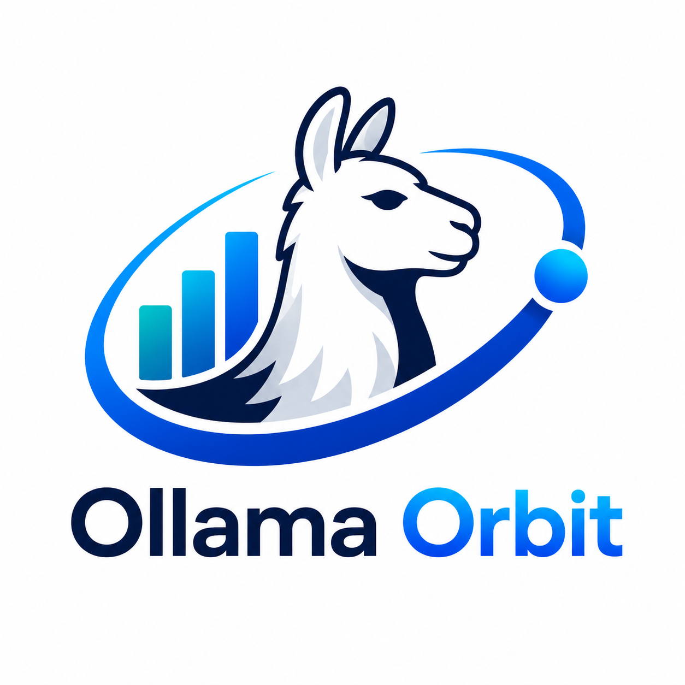
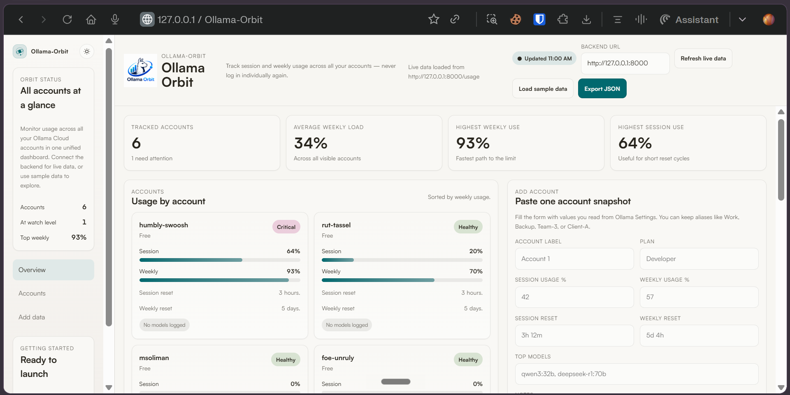
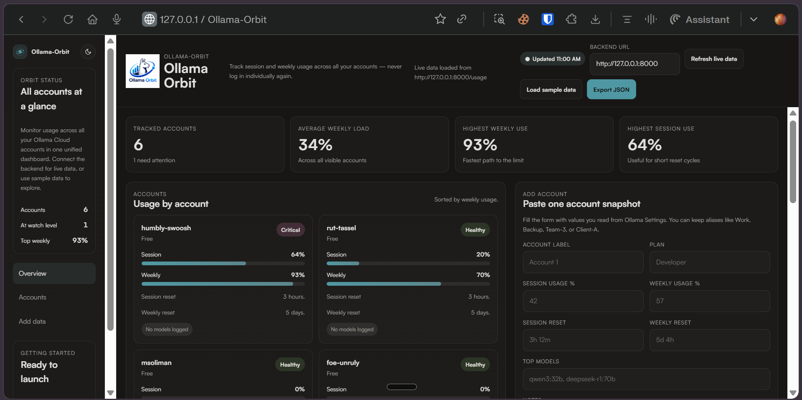

<center>

# **Ollama‑Orbit**



**Your orbital command center for Multiple Ollama Cloud Accounts.**
    


</center>


- Ollama‑Orbit is a self-hosted dashboard that tracks session and weekly usage across **multiple Ollama Cloud accounts** in one unified view — so you never have to re-log into each account individually at https://ollama.com/settings.

- The backend scrapes the Usage page for every configured account using Playwright (saved browser sessions), caches the results, and exposes them through a FastAPI API. The frontend is a beautifully designed HTML dashboard that reads from that API and displays everything at a glance.





## Table of Contents

1. [Project Structure](#project-structure)
2. [How It Works](#how-it-works)
3. [Features](#features)
4. [Prerequisites](#prerequisites)
5. [Installation](#installation)
6. [Configuration](#configuration)
7. [First-Time Login (Save Sessions)](#first-time-login-save-sessions)
   - [Option 1: Cookie-Editor (Recommended)](#option-1-cookie-editor-recommended)
   - [Option 2: Playwright Automated Login (Alternative)](#option-2-playwright-automated-login-alternative)
8. [Running the Backend](#running-the-backend)
9. [Running the Frontend](#running-the-frontend)
10. [API Reference](#api-reference)
11. [Data Model](#data-model)
12. [Fixing the Frontend ↔ Backend Connection (CORS)](#fixing-the-frontend--backend-connection-cors)
13. [Security Notes](#security-notes)
14. [Adapting to Ollama UI Changes](#adapting-to-ollama-ui-changes)
15. [Quick-Start Summary](#quick-start-summary)

---

## Project Structure

```
ollama_dashboard/
├── app/
│   ├── __init__.py          # Package marker
│   ├── config.py            # All configuration: accounts, refresh interval, URLs
│   ├── collector.py         # Playwright scraper + login helper CLI
│   └── main.py              # FastAPI app, scheduler, API endpoints
├── frontend/
│   └── ollama-usage-dashboard.html  # Single-file HTML/CSS/JS dashboard
├── sessions/                # Browser session files (one per account)
│   ├── cookies_account_1.json    # Raw cookies exported from Cookie-Editor
│   ├── cookies_account_2.json    # (Optional) cookies for account 2
│   ├── state_account_1.json      # Converted Playwright session
│   ├── state_account_2.json      # (Optional) session for account 2
│   └── ...
├── tools/
│   └── cookies_to_state.py       # Converts cookie files to Playwright sessions
├── requirements.txt         # Python dependencies
├── .env                     # Environment variables (create this — never commit)
└── README.md
```

> **Important:** The `sessions/` folder and `.env` file contain secrets.
> Treat them as sensitive data — never commit them to any public repository.

---

## How It Works

```
┌──────────────────────────────────────────────────────────────┐
│                        BACKEND                               │
│                                                              │
│  APScheduler (every N minutes)                               │
│       │                                                      │
│       ▼                                                      │
│  collector.py ──► Playwright (headless browser)              │
│       │               │                                      │
│       │         Loads sessions/state_accountX.json           │
│       │               │                                      │
│       │         Opens https://ollama.com/settings            │
│       │               │                                      │
│       │         Parses: session %, weekly %, resets,         │
│       │         per-model request counts (session + weekly)  │
│       │                                                      │
│       ▼                                                      │
│  usage_cache (in-memory list of account objects)             │
│       │                                                      │
│  FastAPI ──► GET /usage  ──► returns JSON cache             │
│         └──► GET /       ──► health check                   │
└──────────────────────────────────────────────────────────────┘
                          │  HTTP fetch on demand
                          ▼
┌──────────────────────────────────────────────────────────────┐
│                      FRONTEND                                │
│                                                              │
│  frontend/ollama-usage-dashboard.html                        │
│  ├── KPI cards: tracked accounts, avg/highest usage          │
│  ├── Cards View: session/weekly bars + reset timers          │
│  ├── Table View: side-by-side comparison                     │
│  ├── Dark/Light theme toggle                                 │
│  └── Connected directly to /usage API                        │
└──────────────────────────────────────────────────────────────┘
```

---

## Features

- **🚀 Multi-account orbit** — Monitor unlimited Ollama Cloud accounts from one screen
- **📊 Real-time KPIs** — Average load, highest usage, accounts needing attention
- **🤖 Per-model usage tracking** — See exactly which models you used (session + weekly request counts)
- **🌙 Dark & light themes** — Built-in theme toggle for day/night usage
- **🔗 Live backend connection** — Fetches fresh data from your FastAPI backend
- **💾 Sample data fallback** — Explore the dashboard even without a running backend
- **📤 Export to JSON** — Download your account data anytime
- **🔄 Auto-refresh** — Scheduler in backend keeps data current (configurable interval)

---

## Prerequisites

- **Python 3.10+**
- **pip**
- Ollama Cloud accounts with access to the Usage page at https://ollama.com/settings
- Basic command-line familiarity

---

## Installation

### 1. Clone / Download the project

```bash
git clone https://github.com/Soliman2020/Ollama_Orbit.git
cd ollama_dashboard
```

### 2. Create and activate a virtual environment (recommended)

```bash
python -m venv venv

# Windows
venv\Scripts\activate.ps1
```

### 3. Install Python dependencies

```bash
pip install -r requirements.txt
```

`requirements.txt` includes:
- `fastapi` — the API framework
- `uvicorn` — the ASGI server that runs FastAPI
- `playwright` — headless browser automation for scraping
- `apscheduler` — background job scheduler
- `python-dotenv` *(optional)* — for loading secrets from a `.env` file

### 4. Install Playwright browsers

```bash
playwright install chromium
```

---

## Configuration

All settings live in `app/config.py`. Open it and edit the following:

```python
# app/config.py

ACCOUNTS = [
    {
        "name": "Account_1",          # Label shown in the dashboard
        "plan": "Free",               # Plan label (Free / Developer / Pro)
        "email": "you@example.com",   # Ollama login email
        "password": "secret123",      # Password — or use os.getenv("OLLAMA_PWD_1")
        "storage": "sessions/state_account1.json",  # Session file path
        "notes": "",                  # Optional internal note
    },
    # ... repeat for each account
]

REFRESH_MINUTES = 10          # How often the scheduler re-scrapes all accounts
SETTINGS_URL = "https://ollama.com/settings"  # Change only if Ollama moves this page
```

**Tip — use environment variables instead of hardcoded passwords:**

```python
import os
"password": os.getenv("OLLAMA_PWD_1", "fallback-only-for-dev"),
```

Then create a `.env` file (never commit it):

```
OLLAMA_EMAIL_1 = YOUR_EMAIL
OLLAMA_PASSWORD_1 = YOUR_PASSWORD

OLLAMA_EMAIL_2 = YOUR_EMAIL
OLLAMA_PASSWORD_2 = YOUR_PASSWORD

```

---

## First-Time Login (Save Sessions)

Before Ollama‑Orbit can scrape your accounts, it needs authenticated browser sessions.
You have two options:

### Option 1: Cookie-Editor (Recommended)

This method uses the **Cookie-Editor** browser extension — faster and more reliable than automated login.

#### Step 1: Install Cookie-Editor

Install the **Cookie-Editor** extension for your browser:
- **Chrome/Edge/Brave:** [Cookie-Editor on Chrome Web Store](https://chromewebstore.google.com/detail/cookie-editor/hlkenndednhfkekhgcdicdfddnkalmdm)

#### Step 2: Log in manually to each Ollama account

1. Open your browser with the Cookie-Editor extension installed
2. Go to https://ollama.com and sign in with your first account's credentials
3. Navigate to https://ollama.com/settings to verify you're logged in
4. Click the **Cookie-Editor extension icon** in your browser toolbar
5. Click **Export** (or the download icon) to export all cookies
6. Copy the exported JSON content

#### Step 3: Save the cookies file

Create a file named `cookies_account_1.json` in the `sessions/` folder and paste the JSON content:

```bash
# Example for account 1
sessions/
├── cookies_account_1.json   # Paste exported cookies here
├── cookies_account_2.json  # For account 2
└── ...
```

Repeat for each Ollama account (each account needs its own `cookies_account_N.json` file).

#### Step 4: Convert cookies to Playwright session

Run the conversion tool:

```bash
python tools/cookies_to_state.py
```

This will convert all `cookies_account_*.json` files in `sessions/` into `state_account_*.json` files.

> **Note:** Run this once per account, or whenever a session expires.

---

### Option 2: Playwright Automated Login (Alternative)

If you prefer automated login, Playwright can open a browser and let you log in:

```bash
# From the project root with your venv active:
python -m app.collector --manual
```

This will open a visible browser window for each account, log in using the credentials in `config.py`,
and save a `state_account_X.json` file into the `sessions/` folder.

> ⚠️ This method may fail due to Cloudflare bot detection. If you encounter issues, use **Option 1 (Cookie-Editor)** instead.

After either method, Playwright will reuse those saved sessions — no more interactive logins are needed.

---

## Running the Backend

```bash
# From the project root:
uvicorn app.main:app --host 127.0.0.1 --port 8000
```

On startup the backend will:
1. Trigger an immediate usage collection for all accounts.
2. Start the APScheduler job that re-collects every `REFRESH_MINUTES`.
3. Serve the API at `http://127.0.0.1:8000`.

**Verify it is running:**

| URL | Expected response |
|-----|-------------------|
| http://127.0.0.1:8000/ | `{"status":"ok","accounts":6}` |
| http://127.0.0.1:8000/usage | JSON array of all account objects |
| http://127.0.0.1:8000/docs | Swagger UI — interactive API documentation |

---

## Running the Frontend

> **Do NOT open `ollama-usage-dashboard.html` by double-clicking it.**
> Opening it as a `file://` URL causes CORS errors — the browser blocks the fetch to the backend.
> See [Fixing the Frontend ↔ Backend Connection (CORS)](#fixing-the-frontend--backend-connection-cors) below.

### Correct way — serve it via a local HTTP server

Open a **second terminal** (keep the backend running in the first):

```bash
cd C:\Users\msoli\Desktop\ollama_dashboard\frontend
python -m http.server 3000
```

Then open your browser and go to:

```
http://127.0.0.1:3000/ollama-usage-dashboard.html
```

The Ollama‑Orbit dashboard will connect to the backend at `http://127.0.0.1:8000/usage` and display all account data.
Click **Refresh live data** to fetch latest usage.

---

## API Reference

| Method | Endpoint | Description |
|--------|----------|-------------|
| GET | `/` | Health check — returns `{"status":"ok","accounts":N}` |
| GET | `/usage` | Returns latest scraped usage for all accounts |

**Interactive docs:** http://127.0.0.1:8000/docs (Swagger UI, version 0.1.0)

---

## Data Model

Each account object returned by `GET /usage` looks like this:

```json
{
  "name": "Account_1",
  "plan": "Free",
  "sessionPercent": 0,
  "weeklyPercent": 38,
  "sessionReset": "2 hours.",
  "weeklyReset": "5 days.",
  "models": ["kimi-k2.6"],
  "sessionModels": [
    { "model": "kimi-k2.6", "requests": 2 }
  ],
  "weeklyModels": [
    { "model": "kimi-k2.6", "requests": 2 }
  ],
  "notes": ""
}
```

| Field | Type | Description |
|-------|------|-------------|
| `name` | string | Account label from `config.py` |
| `plan` | string | Plan tier (Free / Developer / Pro) |
| `sessionPercent` | number | Session usage % from the Ollama Usage page |
| `weeklyPercent` | number | Weekly usage % from the Ollama Usage page |
| `sessionReset` | string | Time until session resets, e.g. `"2 hours."` |
| `weeklyReset` | string | Time until weekly resets, e.g. `"5 days."` |
| `models` | string[] | Unique model names derived from session + weekly usage (top-level convenience list) |
| `sessionModels` | `{model, requests}[]` | Per-model request counts for the current session |
| `weeklyModels` | `{model, requests}[]` | Per-model request counts for the current week |
| `notes` | string | Optional internal label set in `config.py` |

The full response envelope is:

```json
{
  "accounts": [ "...array of account objects..." ],
  "error": null
}
```

---

## Fixing the Frontend ↔ Backend Connection (CORS)

If you open `dashboard.html` directly from the file system (`file:///...`), the browser treats it as a
**null origin** and blocks all `fetch()` calls to the backend — this is a browser CORS security rule,
not a bug in the code.

**You will see:** the dashboard stays on "Connecting…" with dashes for all values.

### Fix A — Serve the frontend via HTTP (simplest, recommended)

```bash
cd frontend
python -m http.server 3000
# Then open: http://127.0.0.1:3000/dashboard.html
```

This allows the browser to deliver the API response even when the HTML is opened from a `file://` URL.

---

## Security Notes

- **Do not expose the backend publicly** without adding authentication (e.g., API keys, OAuth).
- **Do not commit `sessions/`** — those JSON files contain authenticated browser sessions equivalent to login cookies.
- **Do not hardcode passwords** in `config.py` if you plan to share or publish the code. Use `os.getenv()` and a `.env` file instead.
- The scraper only reads your own Ollama Usage page; it does not send credentials or data anywhere else.

---

## Adapting to Ollama UI Changes

The collector parses the Ollama settings page by looking for specific text patterns:

- `Session usage` → followed by a percentage
- `Weekly usage` → followed by a percentage
- `Resets in` → followed by a time string
- Model lines ending in `requests`

If Ollama redesigns their settings page, update the selectors and regex patterns in
`app/collector.py` to match the new layout.

---

## Quick-Start Summary

```bash
# 1. Install dependencies
pip install -r requirements.txt
playwright install chromium

# 2. Configure your accounts
#    Edit app/config.py — add account names and storage paths

# 3. Save sessions (one-time per account using Cookie-Editor)
#    a. Install Cookie-Editor browser extension
#    b. Log in to each Ollama account in your browser
#    c. Export cookies via the extension → save as sessions/cookies_account_1.json
#    d. Repeat for each account
#    e. Convert cookies to Playwright sessions:
python tools/cookies_to_state.py

# 4. Start the backend (Terminal 1)
python -m uvicorn app.main:app --host 127.0.0.1 --port 8000

# 5. Start the frontend server (Terminal 2)
cd frontend
python -m http.server 3000

# 6. Open Ollama‑Orbit in your browser
http://127.0.0.1:3000/frontend/ollama-usage-dashboard.html
```

---

**🚀 Welcome to orbit — enjoy your journey with Ollama‑Orbit!**
